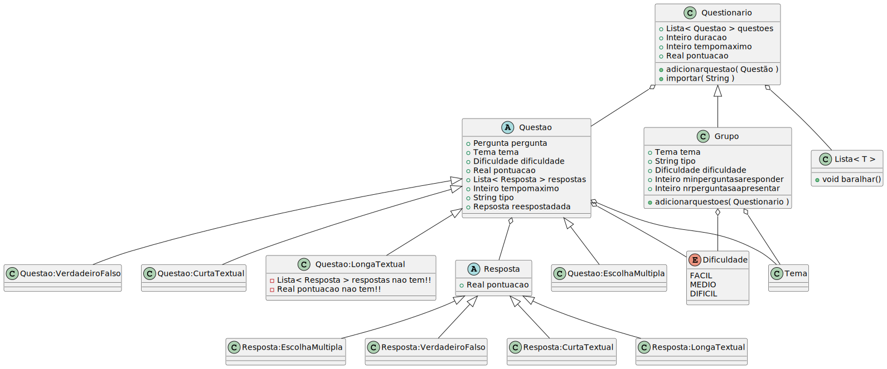

<div id="readme-top"></div>


<!-- PROJECT SHIELDS -->
<div align="center">

[![Forks][forks-shield]][forks-url]
[![Stargazers][stars-shield]][stars-url]
[![Issues][issues-shield]][issues-url]
[![MIT License][license-shield]][license-url]

<!--
[![LinkedIn][mariana-linkedin-shield1]][mariana-linkedin-url]
[![Contributors][mariana-github-shield]][mariana-github-url]
<strong>☜(⌒ᵕ⌒)☞</strong>
[![Contributors][miguel-github-shield]][miguel-github-url]
-->


<!--
☜(⌒▽⌒)☞
<strong>☜(⌒▽⌒)☞</strong>
<strong>☜(⌒ᵕ⌒)☞</strong>
<strong>☜( ˊᵕˋ )☞</strong>
ଘ(੭*ˊᵕˋ)੭* ̀ˋ 
-->
</div>


<!-- PROJECT LOGO 
<br />
<div align="center">
  <a href="https://github.com/github_username/repo_name">
    
  </a>
  -->

<div align="center">


<h3 align="center">Programming Language for Interactive Quizzes</h3>

  <p align="center">
    The final project of the <a href="https://www.ua.pt/en/uc/12272">Compilers</a> course, lectured at University of Aveiro, in the academic year of 2019/2020, as part of my BSc in Informatics Engineering.

  </p>
</div>


<div align="center" highlight="blue">

#### 🚨🚧 Document Under Contruction 🚧🚨

</div>


<!-- TABLE OF CONTENTS -->
<details>
  <summary>Table of Contents</summary>
  <ol>
    <li><a href="#introduction">Introduction</a></li>
    <li><a href="#whats_done">What's done</a></li>
    <li><a href="#whats_to_improve">What's to improve</a></li>
    <li><a href="#try_it_on_your_machine">Try it on your machine</a></li>
    <li><a href="#files_overview">Files Overview</a></li>
    <li><a href="#license">License</a></li>
    <li><a href="#acknowledgments">Acknowledgments</a></li>
  </ol>
</details>


<!-- ABOUT THE PROJECT -->
<!-- ## About The Project -->

<h2 id="introduction">Introduction</h2>
A <strong>transpiler</strong> can be seen as a <i>translator</i> of the source language to a destination language. During this process, not only the syntactic validity of the program should be checked, but also its semantic correctness.

### Goals
The goal of this work involved developing two languages: one for the transpiler -- which is the main language of the project, and one to read structured information.

This process included all phases of construction of programming languages:
- Conception and definition of a programming language (sintax and semantics)
- Lexical analysis implementation in ANTLR4
- Definition of the semantic rules that are to apply to the language, and their application, in regards to the previous point
- Writing documentation on the language
- Critical choice on the destination language
- Definition of the code generation patterns
- Concratization of the transpiler as a whole


<strong>Note</strong>: the information presented on both <strong>Information</strong> and <strong>Goals</strong> are described with more detail in the project guide, which is in Portuguese.
<p align="right">(<a href="#readme-top">back to top</a>)</p>

<h2 id="whats_done">What's done</h2>

### 💡 Idea
The programming language we designed and developed for this project is oriented to creating and manipulating interactive quizzes.

The language supports 4 different types of questions: multiple-choice, true/false, short answer or long answer questions. It also allows the programmer to configure the way the quizz will be delivered, for example, through defining the order that the questions are shown, or defining a time limit for it. (and for the questions themselves too)

The questions can be uploaded from files written in a second language developed in the scope of this projct, or can be created along with the other code. Both options coexist.

When executed, the program will present the user with the quizz defined. It will wait for the users input and store the results, so that it can show a results report at the end of the quiz.


---
<div id="quiz-top"></div>

### 📗 Quiz language
This is the main language of the project, which is more similar to a general programming language. It is responsible for the definition, creation and presentation of the quizz itself. It can be used alone or with a secondary***** language. 

<details>
  <summary>Section Index</summary>
  <ol>
    <li><a href="#types">Types</a></li>
    <ol>
      <li><a href="#">Quizz: <code>Questionario</code></a></li>
      <li><a href="#">Group: <code>Grupo</code></a></li>
      <li><a href="#">Question: <code>Questao</code></a></li>
      <!--<ol>
        <li><a href="#">Multiple Choice Question: Questao:EscolhaMultipla</a></li>
        <li><a href="#">True or False Question: Questao:VerdadeiroFalso</a></li>
        <li><a href="#">Short Answer Question: Question:CurtaTextual</a></li>
        <li><a href="#">Long Answer Question: Question:LongaTextual</a></li>
      </ol>-->
      <li><a href="#">Answer: <code>Resposta</code></a></li>
        <!--<ol>
          <li><a href="#">Multiple Choice Answer: Resposta:EscolhaMultipla</a></li>
          <li><a href="#">True or False Answer: Resposta:VerdadeiroFalso</a></li>
          <li><a href="#">Short Answer: Resposta:CurtaTextual</a></li>
          <li><a href="#">Long Answer: Resposta:LongaTextual</a></li>
        </ol>-->
      <li><a href="#">List: <code>Lista</code></a></li>
      <li><a href="#">Theme: <code>Tema</code></a></li>
      <li><a href="#">Difficulty: <code>Dificuldade</code></a></li>
      <li><a href="#">Other basic types</a></li>
    </ol>
    <li><a href="#">General functionalities</a></li>
    <ol>
      <li><a href="#">Variable declaration and initialization</a></li>
      <li><a href="#">Attribuition of values to variables</a></li>
      <li><a href="#">Comparation structures</a></li>
      <li><a href="#">Desicion structures</a></li>
      <li><a href="#">Cicles</a></li>
    </ol>
    <li><a href="#">Built-in functions</a></li>
    <ol>
      <li><a href="#">Display menu: <code>apresentarMenu</code></a></li>
      <li><a href="#">Display: <code>apresentar</code></a></li>
      <li><a href="#">To string: <code>str</code></a></li>
    </ol>
  </ol>
</details>


#### 🌸 Types
The following class diagram schemes the types supported by the language. Note that this diagram doesn't represent with complete accuracy the structure, since the types aren't classes _per se_.


<p align="right">(<a href="#quiz-top">back to top of the <em>Quiz language</em> section</a>)</p>


##### Quizz: `Questionario` 

`Questionario` *(quizz)* is the type of data that contains the properties of the quiz the user wants to create. These includes the questions that are going to be considered, as well as other customization options, such as the `tempomaximo` *(maximum time)* - which defines a maximum time to complete the quizz, after which the answers won't be stored nor considered for the scoring.

After the quiz is complete, the variable `duracao` *(duration)* will store how long it took to complete, while `pontuacao` *(score)* will contain the scoring of the quiz.

It has two functions associated with it:
- `adicionarquestao` *(add question)*, which accepts as argument a `Questao` *(question)*, and is used to add a question to it
- `importar` *(import)*, which is accepts a `String` with a path to a file written with the previous language. The questions will then be imported to this quiz

The scoring of the test follows the following formulas:

$$
scoreQuestion = \frac{ questionPoints * \sum_{n = 1}^{numberAnswers} pointsObtainedInAnswer(n) }{ 100 }
$$

$$
scoreQuizz = \sum_{n = 1}^{numberQuestions} pointsObtainedInQuestion(n)
$$


<p align="right">(<a href="#quiz-top">back to top of the <em>Quiz language</em> section</a>)</p>

##### Group: `Grupo`
This type is derived from the `Questionario` *(Quizz)*, supporting all of its functionalities, but going a bit further.
`Grupo` *(group)* represents a group of questions, and can be characterized by a `Tema tema` *(theme)*, type and `Dificuldade dificuldade` *(difficulty)*. These attributes are defined when questions are added, through the use of the function `adicionarquestoes` *(add questions)*. An example of the usage of this function is as follows:
```
g2 % adicionarquestoes(q1, tema = [Tema_C], dificuldade = FACIL, tipo = "VerdadeiroFalso").
```
Furthermore, the programmer can also define the minimum  number of questions that the user must complete before submitting the quiz by defining `minperguntasaresponder` *(minimum questions to answer)*, as well as the number of questions to present in the quiz `nrperguntasaapresentar` *(number of questions to present)*.

<p align="right">(<a href="#quiz-top">back to top of the <em>Quiz language</em> section</a>)</p>


##### Question: `Questao`
The `Questao` *(question)* is essential, since it represents a question. `pergunta` *(question)* stores the text of the question, while `Tema tema` *(theme)* defines the theme, `Dificuldade dificuldade` *(difficulty)*  the difficulty and `pontuacao` *(points)* its points. `Lista< Resposta > respostas` *(list of answers)* is a list of possible answers, which is useful for all the question/answer types, with the exception of `LongaTextual` *(long text)* which is covered below. Furthermore, the `tempomaximo` *(maximum time)* can be defined, stating the maxmimum time the user has to answer the question. If this time passes while the user is answering, their answer won't be stored, but the quizz may continue.
Additionally, there's also `tipo` *(type)*, a `String` useful for the programmer that wants to consult this value, for presentation reasons, for example.

To finish, after a quiz is complete, the `Resposta respostadada` *(given answer)* attribute will have information on the answer that the user chose for that question.

In our language, this type has similarities with abstract classes. No question can be created using this type, and its goal is to make the processing of the quizz easier and intuitive for the programmer. Several types of question can be created, which will be covered next.

- ##### Multiple Choice Question: `Questao:EscolhaMultipla`
  This type describes a multiple choice question, and is to be used with `Resposta:EscolhaMultipla`. From all the choices presented, the user must choose at least one.

- ##### True or False Question: `Questao:VerdadeiroFalso`
  This specification of the question type describes a "true or false" question, and is to be used with the `Resposta:VerdadeiroFalso` *(answer: true or false)* answer type. When this question is displayed, the user is presented with multiple sentences/entries. The user must then say wether each one is true or false. More info on the answers below.

- ##### Short Answer Question: `Question:CurtaTextual`
  It represents a question where the user must write their answer to the program. This is to be used with the `Resposta:CurtaTextual` type. The user's answer will then be compared to the answers defined for this question, and if there's a match, it will be graded accordingly.

- ##### Long Answer Question: `Question:LongaTextual`
  This type represents a question where the user is also asked to input text. However, in this case, their answer won't be compared with pre-defined answers, since it's expected the input for this question to be more complex, and impossible for the program to grade on its own. After the quizz is finished, it is possible to display the answer given in the screen, or save it in a file on the computer, allowing the question to be graded manually.
  Therefore, when creating it, no answer type should be added.

<p align="right">(<a href="#quiz-top">back to top of the <em>Quiz language</em> section</a>)</p>

##### Answer: `Resposta`

The `Resposta` *(answer)* represents none other than an answer. Each question has a list of answers that are applicable to it (keeping in mind that the long answer question is indeed a bit different). All answers have information on the points the user would obtain if they chose it or answered correctly - `Real pontuacao` *(points)*, which is shown as `pointsObtainedInAnswer(n)` in the expression above. These can be negative, too, as a way to punish wrong answers!

This type is similar to the `Questao` *(question)*, since it also behaves somewhat like an abstract class. Several types of answers exist, and are explained below.

  - ##### Multiple Choice Answer: `Resposta:EscolhaMultipla`
    This is a basic answer type, which is used with the `Question:EscolhaMultipla` *(multiple choice question)* type. The programmer needs to define the string that will be shown to the user, and also needs the points associated with it as described above.

    ```
    correctAnswer as Resposta:EscolhaMultipla.
    correctAnswer := "Her name is Ariel.", 60. 
    ```

  - ##### True or False Answer: `Resposta:VerdadeiroFalso`
    This is another answer type, which is used with the `Question:VerdadeiroFalso` *(true or false questions)* type. It is a bit different from the previous one, however. Besides the text and points that we described in the previous type, the programmer also needs to inform the `Boolean correcao` *(correction)* and the `Real desconto` *(discount)*. When true or false questions are presented to the user, he will need to evalue the veracity of each one of them. If the user has wrongfuly determined the veracity of one answer, then the points associated with this answer will be the ones stored in `desconto` *(discount)*, instead of those in `pontuacao` *(points)*. 

    ```
    tfAnswer as Resposta:VerdadeiroFalso.
    # order : text, correction, points, discount
    tfAnswer := "Her name is not Ariel.", false, 60, -30.
    ```


  - ##### Short Answer: `Resposta:CurtaTextual`
    This is the answer type associated with `Questao:CurtaTextual`, and it's fairly similar to `Resposta:EscolhaMultipla`. The user only needs to define the text to which the user answer will be matched, and also the points that are to be awarded.

    As a cool feature, it is possible to define many at the same time in a list, using the following sintaxe (note that this also works for the other types of answers):
    ```
    shortAnswerList as Lista<Resposta:CurtaTextual>.
    shortAnswerList := { "Ariel", 20 ; "Sebastian", 30 ; "Ursula", 30; "Flounder", -20 } .
    ```

  - ##### Long Answer: `Resposta:LongaTextual`
    This type is a bit special. It is meant to be created automatically and used only after the quiz is done, in order to store the user's input. There is no way to define it manually.

<p align="right">(<a href="#quiz-top">back to top of the <em>Quiz language</em> section</a>)</p>

##### List: `Lista`
`Lista` is an array-like type that permits the aggregation of multiple objects. 
It implements the method `baralhar`, useful to mix the order of the questions in the quiz, for example:
```
# mix the questions in the quiz
quiz->questoes%baralhar(). 
```

It can be initialized and filled using brackets, and even allows for objects to be initalized at the same time, as already shown above. Some other examples:
```
multipleChoiceList as Lista<Resposta:EscolhaMultipla>.
multipleChoiceList := { "Her name is Ariel.", 60 ; "Her name is Ursula.", -20}. 


trueFalseAnswerList as Lista<Resposta:VerdadeiroFalso>.
trueFalseAnswerList := { "Her name is Ursula.", false, 60, -30 ; The kingdom's name is Atlantica.", true, 40, -20}.
```
<p align="right">(<a href="#quiz-top">back to top of the <em>Quiz language</em> section</a>)</p>

<div id="theme"></div>
##### Theme: `Tema`
This is a simpler data type used to define the theme or topic of a question or question group. It is useful for filtering questions and/or results. These are implemented in a hierarchical fashion, and have an intuitive sintax:
```
# setting the theme of three questions
question1->tema := [TECH->PROGRAMMING->PYTHON].
question2->tema := [TECH->PROGRAMMING->JAVA].
question3->tema := [ART->MUSIC].
```
For example, if we were to add questions to a `Grupo` *(group)*, we could set its `Tema tema` *(theme)* to be `[TECH->PROGRAMMING]`. Then, when we import questions, only the ones that fit this criteria (in our example, `question1` and `question2`) are going to be included in the group.

<p align="right">(<a href="#quiz-top">back to top of the <em>Quiz language</em> section</a>)</p>

##### Difficulty: `Dificuldade`
Another simple data type, `Dificuldade` *(difficulty)* is used to store the difficulty level of the question, and has 3 possible values: `FACIL` *(easy)*, `MEDIO` *(medium)* and `DIFICIL` *(difficult)*. It can be used to filter questions similarly to how `Tema` *(theme)* can be used.
```
# setting the difficulty of a question
question1->dificuldade := FACIL.
```
<p align="right">(<a href="#quiz-top">back to top of the <em>Quiz language</em> section</a>)</p>

##### Other basic types
  The following types are also implemented in this language. Their behaviour is similar to what one might expect.
  - Boolean: `Boolean`
  - Real Number: `Real`
  - Integer Number: `Inteiro`
  - String: `String`
  
<p align="right">(<a href="#quiz-top">back to top of the <em>Quiz language</em> section</a>)</p>

#### 🌻 General functionalities
The developed language supports multiple functionalities commonly present in general-purpose programming language, as already demonstrated. Some of these will be described here as well.

- ##### Variable declaration and initialization
  To declare variables and initialize them, the following sintax is used:
  ```
  q as Questionario.
  tx1 as Questao:CurtaTextual. 
  ```

- ##### Attribuition of values to variables
  When the objects ar initialized, the attributes will have default values. These can be changed with the following sintax:
  ```
  tx1->tema := [TEMA_A].
  tx1->dificuldade := FACIL.
  ```

  Some objects - namely, the `Resposta` *(answer)* types - can be initalized with custom values, using the following sintax:
  ```
  shortAnswerList as Lista<Resposta:CurtaTextual>.
  shortAnswerList := { "Nee", 20 ; "Ja", 30 ; "Ik", 30; "outra", 20 } .
  ```
  In this case, each element that is to be inserted in the list is separated with a `;`.

- ##### Comparation structures
  The supported comparation structures are summarized in the following table:

  | symbol | definition                                |
  | ------ | ----------------------------------------- |
  | `<-`   | less than                                 |
  | `>-`   | greater than                              |
  | `<=`   | less or equal than                        |
  | `>=`   | greater or equal than                     |
  | `!=`   | different than                            |
  | `e`    | logic and _(to be used with expressions)_ |
  | `ou`   | logic or _(to be used with expressions)_  |

- ##### Desicion structures
  The language supports decision structures such as `if`, `else if` and `else`, but with different names (who would say 😉). We opted for the words `se` *(if)*, `ouse` *(else if)* and `senao` *(if not)*. Besides, the code blocks need to be delimited by `inicio` *(begining)* and `fim` *(fim)*.

  ```
  se (g1->pontuacao < p) # p: int variable previously defined
    inicio
      apresentar(“You can't go to the second part. Your score: ” & str(g1->pontuação))
    fim
  senao
    inicio
      apresentar(“Parabéns, concluiu a primeira fase”).
    fim
  ```

- ##### Cicles
  This language supports cycles, more specifically for-each cycles. The word `para` *(for)* is used, and the delimiters are also `inicio` *(begining)* and `fim` *(end)*.
  ```
  para (q as Questao em q1->questoes)
  inicio
    t as String.
    t := “LongaTextual”.
    se (q->tipo == t)
    inicio
      apresentar(“Respostas: “ & str(q->respostadada)).
    fim
  fim
  ```

<p align="right">(<a href="#quiz-top">back to top of the <em>Quiz language</em> section</a>)</p>


#### 🏵 Built-in functions
The developed language has some built-in functions that aren't associated with any types. These are as follows.

- ##### Display menu: `apresentarMenu`
  This is the function used to start the quizz. A `Questionario` *(quizz)* (or `Grupo` *(group)*) needs to be passed in the arguments. Additionally, the user can also provide a number which represent the number of seconds that the user has to finish the quizz. After this time has passsed, the user won't be able to answer or save any unanswered questions.

  ```
  # starts the quizz with the info on techGroup, with time limit of 300 seconds
  apresentarMenu(techGroup, 300).
  ```

- ##### Display: `apresentar`
  Used to print something in the console.
  ```
  apresentar(“Hello world").
  ```

- #### To string: `str`
  Used to convert number values to `String`.
  ```
  apresentar(The pontuation is: ” & str(techGroup->pontuacao)).
  ```

<p align="right">(<a href="#quiz-top">back to top of the <em>Quiz language</em> section</a>)</p>


### Database Language
It was with the goal of facilitating the storage of questions that this secondary language was created. It allows the quizz creator to write and save questions that are directly interepreted by the primary language. When creating the quiz, we can add questions dynamically in the code, or import them from a file where this language should be employed.

#### Sintax overview
- ##### Questions

  The code block below shows a schema of how the questions are defined. All question types follow the same schema, except the `LongaTextual` *(long answer question)*, which does not accept any answers.

  ```
  # for most question types
  questao:<type of question> <optional: difficulty> <optional: points> <theme> <optional: question text>
  inicio
    <one or more answers>
  fim

  # for LongaTextual question type
  questao:<type of question> <optional: difficulty> <optional: points> <theme> <optional: question text>
  ```


  The annotations in the schemas are described in the following table.

  | annotation       | possible values                               |
  | ---------------- | --------------------------------------------- |
  | type of question | `EscolhaMultipla` *(multiple choice)* <br /> `VerdadeiroFalso` *(true or false)* <br /> `CurtaTextual` *(short answer)* <br /> `LongaTextual` *(long answer)* |
  | difficulty             | `facil` *(easy)*<br /> `medio` *(medium)* <br /> `dificil` *(difficult)* |
  | points             | any integer value |
  | theme             | `[ THEME1 ( -> SUBTHEME1 -> ... ) ]` <br /> - this follows an hierarchichal approach, as described <a href="#theme">here</a> <br />-  the `THEME1` and `SUBTHEME1` in the schema represent any alphanumerical string |
  | question text   | any string  |


- ##### Answer
  Answers need to be provided to any question other than `LongaTextual` *(long answer question)*. They need to follow the schema in the code block below. 
  ```
  # for most answer/question types
  <answer text> pontuacao=<points>;

  #for VerdadeiroFalso answer/question types
  <answer text> <correction> pontuacao=( <points awarded if right>, <points awarded if wrong>)
  ```

  Similarly, the following table described the annotations in the schemas.

  | annotation       | possible values                               |
  | ---------------- | --------------------------------------------- |
  | answer text | any string |
  | points | any integer value |
  | correction | `true` <br /> `false` |
  | points awarded if right | any integer value |
  | points awarded if wrong | any integer value  |


<p align="right">(<a href="#readme-top">back to top</a>)</p>

<h2 id="whats_to_improve">What's to improve</h2>
A lot.


<p align="right">(<a href="#readme-top">back to top</a>)</p>

<!-- GETTING STARTED -->
<h2 id="try_it_on_your_machine">Try it on your machine</h2>
Yet to be ~ <strong>ଘ(੭*ˊᵕˋ)੭* ̀ˋ</strong> ~ written!


<p align="right">(<a href="#readme-top">back to top</a>)</p>

<!-- LICENSE -->
<h2 id="license">License</h2>

Distributed under the MIT License. See `LICENSE` for more information.

<p align="right">(<a href="#readme-top">back to top</a>)</p>


<!-- ACKNOWLEDGMENTS -->
<h2 id="acknowledgments">Acknowledgments</h2>

[DETI - Departamento de Eletrónica, Telecomunicações e Informática](https://www.ua.pt/pt/deti)

<p align="right">(<a href="#readme-top">back to top</a>)</p>


<!-- MARKDOWN LINKS & IMAGES -->
<!-- https://www.markdownguide.org/basic-syntax/#reference-style-links -->

[forks-shield]: https://img.shields.io/github/forks/immarianaas/c-quiz-language.svg?style=for-the-badge
[forks-url]: https://github.com/immarianaas/c-quiz-language/network/members

[stars-shield]: https://img.shields.io/github/stars/immarianaas/c-quiz-language.svg?style=for-the-badge
[stars-url]: https://github.com/immarianaas/c-quiz-language/stargazers

[issues-shield]: https://img.shields.io/github/issues/immarianaas/c-quiz-language.svg?style=for-the-badge
[issues-url]: https://github.com/immarianaas/c-quiz-language/issues

[license-shield]: https://img.shields.io/github/license/immarianaas/c-quiz-language.svg?style=for-the-badge
[license-url]: https://github.com/immarianaas/c-quiz-language/blob/master/LICENSE

<!--
[linkedin-shield]: https://img.shields.io/badge/-LinkedIn-black.svg?style=for-the-badge&logo=linkedin&colorB=555
[linkedin-url]: https://linkedin.com/in/linkedin_username
-->

[product-screenshot]: images/screenshot.png
[Next.js]: https://img.shields.io/badge/next.js-000000?style=for-the-badge&logo=nextdotjs&logoColor=white
[Next-url]: https://nextjs.org/
[React.js]: https://img.shields.io/badge/React-20232A?style=for-the-badge&logo=react&logoColor=61DAFB
[React-url]: https://reactjs.org/
[Vue.js]: https://img.shields.io/badge/Vue.js-35495E?style=for-the-badge&logo=vuedotjs&logoColor=4FC08D
[Vue-url]: https://vuejs.org/
[Angular.io]: https://img.shields.io/badge/Angular-DD0031?style=for-the-badge&logo=angular&logoColor=white
[Angular-url]: https://angular.io/
[Svelte.dev]: https://img.shields.io/badge/Svelte-4A4A55?style=for-the-badge&logo=svelte&logoColor=FF3E00
[Svelte-url]: https://svelte.dev/
[Laravel.com]: https://img.shields.io/badge/Laravel-FF2D20?style=for-the-badge&logo=laravel&logoColor=white
[Laravel-url]: https://laravel.com
[Bootstrap.com]: https://img.shields.io/badge/Bootstrap-563D7C?style=for-the-badge&logo=bootstrap&logoColor=white
[Bootstrap-url]: https://getbootstrap.com
[JQuery.com]: https://img.shields.io/badge/jQuery-0769AD?style=for-the-badge&logo=jquery&logoColor=white
[JQuery-url]: https://jquery.com 


[mariana-github-shield1]: https://img.shields.io/badge/--black.svg?style=for-the-badge&logo=github&colorB=555
[mariana-linkedin-shield1]: https://img.shields.io/badge/--black.svg?style=for-the-badge&logo=linkedin&colorB=0e76a8

[mariana-github-shield]: https://img.shields.io/badge/-Mariana-black.svg?style=for-the-badge&logo=github&colorB=555
[mariana-linkedin-shield]: https://img.shields.io/badge/-Mariana-black.svg?style=for-the-badge&logo=linkedin&colorB=555

[mariana-github-url]: https://github.com/immarianaas
[mariana-linkedin-url]: https://www.linkedin.com/in/immarianaas


[miguel-github-shield1]: https://img.shields.io/badge/--black.svg?style=for-the-badge&logo=github&colorB=555
[miguel-linkedin-shield1]: https://img.shields.io/badge/--black.svg?style=for-the-badge&logo=linkedin&colorB=0e76a8

[miguel-github-shield]: https://img.shields.io/badge/-Miguel-black.svg?style=for-the-badge&logo=github&colorB=555
[miguel-linkedin-shield]: https://img.shields.io/badge/-Miguel-black.svg?style=for-the-badge&logo=linkedin&colorB=555

[miguel-github-url]: https://github.com/Miguel17297
[miguel-linkedin-url]: https://github.com/immarianaas/c-quiz-language

[Python-logo]: https://img.shields.io/badge/Python-306998?style=for-the-badge&amp;logo=python&amp;logoColor=white
[Python-url]: https://python.org