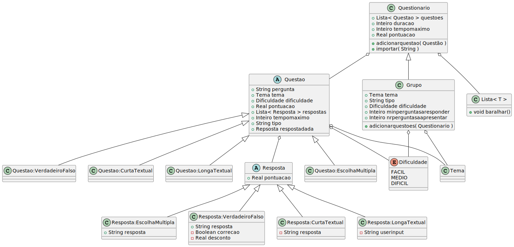

<div id="readme-top"></div>


<!-- PROJECT SHIELDS -->
<div align="center">

[![Forks][forks-shield]][forks-url] [![Stargazers][stars-shield]][stars-url] [![Issues][issues-shield]][issues-url] [![MIT License][license-shield]][license-url]


[![LinkedIn][linkedin-shield]][diogo-linkedin-url][![Contributors][diogo-github-shield]][diogo-github-url] &nbsp;&nbsp;  [![LinkedIn][linkedin-shield]][luis-linkedin-url][![Contributors][luis-github-shield]][luis-github-url] &nbsp;&nbsp;  [![LinkedIn][linkedin-shield]][maria-linkedin-url][![Contributors][maria-github-shield]][maria-github-url] &nbsp;&nbsp;  [![LinkedIn][linkedin-shield]][mariana-linkedin-url][![Contributors][mariana-github-shield]][mariana-github-url] &nbsp;&nbsp;  [![LinkedIn][linkedin-shield]][rafael-linkedin-url][![Contributors][rafael-github-shield]][rafael-github-url] 

</div>

<!--

ordem:

- Diogo
- Luis
- Maria
- Mariana
- Rafael

[![LinkedIn][mariana-linkedin-shield1]][mariana-linkedin-url]
[![Contributors][mariana-github-shield]][mariana-github-url]
<strong>☜(⌒ᵕ⌒)☞</strong>
[![Contributors][miguel-github-shield]][miguel-github-url]
-->


<!--
☜(⌒▽⌒)☞
<strong>☜(⌒▽⌒)☞</strong>
<strong>☜(⌒ᵕ⌒)☞</strong>
<strong>☜( ˊᵕˋ )☞</strong>
ଘ(੭*ˊᵕˋ)੭* ̀ˋ 
-->


<!-- PROJECT LOGO 
<br />
<div align="center">
  <a href="https://github.com/github_username/repo_name">
    
  </a>
  -->

<div align="center">


<h3 align="center">Programming Language for Interactive Quizzes</h3>

  <p align="center">
    The final project of the <a href="https://www.ua.pt/en/uc/12272">Compilers</a> course, lectured at University of Aveiro, in the academic year of 2019/2020, as part of my BSc in Informatics Engineering.

  </p>
</div>


<div align="center" highlight="blue">

<!--
#### 🚨🚧 Document Under Contruction 🚧🚨
-->

</div>


<!-- TABLE OF CONTENTS -->
<details>
  <summary>Table of Contents</summary>
  <ol>
    <li><a href="#introduction">Introduction</a>
      <ol>
        <li><a href="#goals">Goals</a>
      </ol>
    </li>
    <li><a href="#whats_done">What's done</a>
      <ol>
        <li><a href="#idea">Idea</a>
        <li><a href="#built_with">Built with</a>
        <li><a href="#quiz_language">Quiz language</a>
        <li><a href="#database_language">Database language</a>
      </ol>
    </li>
    <li><a href="#whats_to_improve">What's to improve</a></li>
      <ol>
        <li><a href="#looking_back">Looking back & other considerations</a>
      </ol>
    <li><a href="#try_it_on_your_machine">Try it on your machine</a></li>
    <li><a href="#license">License</a></li>
    <li><a href="#acknowledgments">Acknowledgments</a></li>
  </ol>
</details>


<!-- ABOUT THE PROJECT -->
<!-- ## About The Project -->

<h2 id="introduction">Introduction</h2>
A <strong>transpiler</strong> can be seen as a <i>translator</i> of the source language to a destination language. During this process, not only the syntactic validity of the program should be checked, but also its semantic correctness.

<h3 id="goals">🏁 Goals</h3>
The goal of this work involved developing two languages: one for the transpiler - which is the main language of the project -, and the other to read structured information.

This process included all phases of construction of programming languages:
- Conception and definition of a programming language (syntax and semantics)
- Lexical analysis implementation in <a href="https://www.antlr.org/">ANTLR4</a>
- Definition and enforcement of the semantic rules apply to the language
- Writing documentation on the language
- Critical choice on the destination language
- Definition of the code generation patterns
- Concretization of the transpiler as a whole


<strong>Note</strong>: the information presented on both <strong>Information</strong> and <strong>Goals</strong> is described with more detail in the <a href="https://github.com/immarianaas/c-quiz-language/blob/main/trabalho.pdf">project guide</a>, which is in Portuguese.
<p align="right">(<a href="#readme-top">back to top</a>)</p>

<h2 id="whats_done">What's done</h2>

<h3 id="idea">💡 Idea</h3>
The programming language we designed and developed for this project is oriented to creating and manipulating interactive quizzes.

The language supports 4 different types of questions: 
- multiple choice questions
- true or false questions
- short answer questions
- long answer questions

It also allows the programmer to configure the way the quiz will be delivered. For example, it is possible to define the order in which the questions are shown, or to define a time limit for not only each question, but also for the whole quiz.

The questions can be defined along the rest of the code for the quiz, or separately, in well-structured text files. This is where the second language comes in handy. It is used to read questions from text files, allowing them to act as databases for easier reuse of questions in different quizzes.

When a quiz is programmed and executed, the program will present it to the user. Then it will patiently wait for the user's input, storing it. The programmer can also choose to display the results report or answers given in the screen, or save them in a text file to be reviewed later.

<p align="right">(<a href="#readme-top">back to top</a>)</p>

<h3 id="built_with">🏗 Built with</h3>

[![ANTLR][antlr-shield]][antlr-url] [![Java][java-shield]][java-url]

<p align="right">(<a href="#readme-top">back to top</a>)</p>


<div id="quiz-top"></div>

<h3 id="quiz_language">📗 Quiz language</h3>
This is the main language of the project, which is somewhat similar to a general-purpose programming language. It is responsible for the definition, creation and presentation of the quiz itself.

<details>
  <summary>Section Index</summary>
  <ol>
    <li><a href="#types">Types</a></li>
    <ol>
      <li><a href="#quiz">Quiz: <code>Questionario</code></a></li>
      <li><a href="#group">Group: <code>Grupo</code></a></li>
      <li><a href="#question">Question: <code>Questao</code></a></li>
      <li><a href="#answer">Answer: <code>Resposta</code></a></li>
      <li><a href="#list">List: <code>Lista</code></a></li>
      <li><a href="#theme">Theme: <code>Tema</code></a></li>
      <li><a href="#difficulty">Difficulty: <code>Dificuldade</code></a></li>
      <li><a href="#other_basic_types">Other basic types</a></li>
    </ol>
    <li><a href="#general_functionalities">General functionalities</a></li>
    <ol>
      <li><a href="#variable_declaration_and_initialization">Variable declaration and initialization</a></li>
      <li><a href="#attribution_of_values_to_variables">Attribuition of values to variables</a></li>
      <li><a href="#comparation_structures">Comparation structures</a></li>
      <li><a href="#decision_structures">Decision structures</a></li>
      <li><a href="#cicles">Cicles</a></li>
      <li><a href="#other_features_remarks">Other features & remarks</a></li>
    </ol>
    <li><a href="#builtin_functions">Built-in functions</a></li>
    <ol>
      <li><a href="#display_menu">Display menu: <code>apresentarMenu</code></a></li>
      <li><a href="#display">Display: <code>apresentar</code></a></li>
      <li><a href="#to_string">To string: <code>str</code></a></li>
    </ol>
  </ol>
</details>

<div id="types"></div>

#### 🌸 Types
The following class diagram schemes the types supported by the language. Note that this diagram doesn't represent with complete accuracy the structure, since our types aren't classes _per se_.


<p align="right">(<a href="#quiz-top">back to top of the <em>Quiz language</em> section</a>)</p>


<div id="quiz"></div>

##### Quiz: `Questionario` 

`Questionario` *(quiz)* is the type of data that contains the properties of the quiz the programmer wants to create. These includes the questions that are going to be considered, as well as the `tempomaximo` *(maximum time)* - which defines a maximum time to complete the quiz, after which the answers won't be stored nor considered for the scoring.

After the user has completed the quiz, the variable `duracao` *(duration)* will store the time it took the user to complete, while `pontuacao` *(score)* will contain the awarded score.

It has two functions associated with it:
- `adicionarquestao` *(add question)*, which accepts as argument a `Questao` *(question)*, and is used to add a question to it
- `importar` *(import)*, which accepts a `String` with a path to a file written according to the <a href="#database_language"> second, database language</a>. All the questions there will then be imported to this quiz

The scoring of the test follows the following formulas:

$$
pointsObtainedInQuestion = \frac{ questionPoints * \sum_{n = 1}^{numberAnswers} pointsObtainedInAnswer(n) }{ 100 }
$$

$$
scoreQuiz = \sum_{n = 1}^{numberQuestions} pointsObtainedInQuestion(n)
$$


<p align="right">(<a href="#quiz-top">back to top of the <em>Quiz language</em> section</a>)</p>

<div id="group"></div>

##### Group: `Grupo`
This type is derived from the `Questionario` *(quiz)*, supporting all of its functionalities, but going a bit further.
`Grupo` *(group)* represents a group of questions, and can be characterized by a `Tema tema` *(theme)*, type and `Dificuldade dificuldade` *(difficulty)*. These attributes are defined when questions are added, through the use of the function `adicionarquestoes` *(add questions)*. An example of the usage of this function is as follows:
```
g2 % adicionarquestoes(q1, tema = [Tema_C], dificuldade = FACIL, tipo = "VerdadeiroFalso").
```
When using this function, only the questions matched with the arguments are imported.
Furthermore, the programmer can define the minimum  number of questions that the user must complete before submitting the quiz, by defining `minperguntasaresponder` *(minimum questions to answer)*, as well as the number of questions to present in the quiz - `nrperguntasaapresentar` *(number of questions to present)*.

<p align="right">(<a href="#quiz-top">back to top of the <em>Quiz language</em> section</a>)</p>


<div id="question"></div>

##### Question: `Questao`
The `Questao` *(question)* type is essential, since it represents a question. The attribute `pergunta` *(question)* stores the text of the question, while `Tema tema` *(theme)* defines the theme, `Dificuldade dificuldade` *(difficulty)*  the difficulty and `pontuacao` *(points)* its points. `Lista< Resposta > respostas` *(list of answers)* is a list of possible answers, which is useful for all the question/answer types, with the exception of `LongaTextual` *(long answer question)*, which is covered below. Furthermore, the `tempomaximo` *(maximum time)* can be defined, stating the maxmimum time the user has to answer the question. If this time passes while the user is answering, their answer won't be stored, but the quiz may continue.
Additionally, there's  `tipo` *(type)*, a `String` useful for presentation and filtering reasons, just no name a few.

To finish, after a quiz is complete, the `Resposta respostadada` *(given answer)* attribute will have information on the answer that the user chose for that question.

In our language, this type has some similarities with abstract classes. No question can be created using this type, and its goal is to make the processing of the quiz easier and intuitive for the programmer. Several types of questions can be created, which are covered below.

- ##### Multiple Choice Question: `Questao:EscolhaMultipla`
  This type describes a multiple choice question, and is to be used with `Resposta:EscolhaMultipla`. From all the choices presented, the user must choose at least one.

  Below is an example of how such a question could be define. Note that the other questions follow very similar patterns.
  ```
  # initializing the question
  mcQuestion as Questao:EscolhaMultipla.

  # defining the question text
  mcQuestion->pergunta := "How old is Ariel?".

  # defining the difficulty
  mcQuestion->dificuldade := FACIL.

  # defining the question points
  mcQuestion->pontuacao := 50.

  # defining the possible answers (covered more in depth below)
  answers as Lista<Resposta:EscolhaMultipla>.
  answers := { "10 years", -40 ; "14 years", -20 ; "16 years", 100 }.
  mcQuestion->respostas := answers.

  # defining a maximum time to answer the question
  mcQuestion->tempomaximo := 30.
  ```

- ##### True or False Question: `Questao:VerdadeiroFalso`
  This is type describes a "true or false" question, and is to be used with the `Resposta:VerdadeiroFalso` *(answer: true or false)* answer type. When this question is displayed, the user is presented with multiple sentences/entries. The user must then say wether each one is true or false. More info on the answers below.

- ##### Short Answer Question: `Question:CurtaTextual`
  It represents a question where the user must write their answer to the program. This is to be used with the `Resposta:CurtaTextual` type. The user's answer will then be compared to the answers defined for this question, and if there's a match, it will be graded accordingly.

- ##### Long Answer Question: `Question:LongaTextual`
  This type represents a question where the user is also asked to input text. However, in this case, their answer won't be compared with pre-defined answers, since it's expected the input for this question to be more complex, and impossible for the program to grade on its own. After the quiz is finished, it is possible to display the answer given in the screen, or to save it in a file on the computer, allowing the question to be graded manually.
  Therefore, when creating it, no answer should be defined or added.

<p align="right">(<a href="#quiz-top">back to top of the <em>Quiz language</em> section</a>)</p>

<div id="answer"></div>

##### Answer: `Resposta`

The `Resposta` *(answer)* represents none other than an answer. Each question has a list of answers that are applicable to it (with the exception of the long answer question, which is going to be discussed soon). All answers have information on the points the user would obtain if they choose it or answer correctly - `Real pontuacao` *(points)*, which is shown as `pointsObtainedInAnswer(n)` in the expression above. These can be negative, too, as a way to punish wrong answers!

This type is similar to the `Questao` *(question)*, in the sense that it also behaves like an abstract class. Several types of answers exist, and are explained below.

  - ##### Multiple Choice Answer: `Resposta:EscolhaMultipla`
    This is the answer type used with the `Question:EscolhaMultipla` *(multiple choice question)* type. The programmer needs to define the string that will be shown to the user, and also needs to inform the points associated with it as described above.

    ```
    correctAnswer as Resposta:EscolhaMultipla.
    correctAnswer := "Her name is Ariel.", 60. 
    ```

  - ##### True or False Answer: `Resposta:VerdadeiroFalso`
    This is another answer type, used with the `Question:VerdadeiroFalso` *(true or false questions)* type. It is a bit different from the previous one, however. Besides the text and points described in the previous type, the programmer also needs to inform the `Boolean correcao` *(correction)* and the `Real desconto` *(discount)*. When true or false questions are presented to the user, he will need to evalue the veracity of each one of them. If the user has wrongfuly determined the veracity of one answer, then the points associated with this answer will be the ones stored in `desconto` *(discount)*, instead of those in `pontuacao` *(points)*. 

    ```
    tfAnswer as Resposta:VerdadeiroFalso.
    # order : text, correction, points, discount
    tfAnswer := "Her name is not Ariel.", false, 60, -30.
    ```


  - ##### Short Answer: `Resposta:CurtaTextual`
    This is the answer type associated with `Questao:CurtaTextual`, and it's fairly similar to `Resposta:EscolhaMultipla`. The programmer only needs to define the text to which the user input will be matched, and also the points that are to be awarded.

    As a cool feature, it is possible to define many at the same time in a list, using the following syntax (note that this also works for the other types of answers):
    ```
    shortAnswerList as Lista<Resposta:CurtaTextual>.
    shortAnswerList := { "Ariel", 20 ; "Sebastian", 30 ; "Ursula", 30; "Flounder", -20 } .
    ```

  - ##### Long Answer: `Resposta:LongaTextual`
    This type is a bit special. It is meant to be created automatically and used only after the quiz is done, in order to store the user's input. It is not possible to define it manually.

<p align="right">(<a href="#quiz-top">back to top of the <em>Quiz language</em> section</a>)</p>

<div id="list"></div>

##### List: `Lista`
`Lista` is an array-like type that permits the aggregation of multiple objects. 
It implements the method `baralhar`, useful to mix the order of the questions in the quiz, for example:
```
# mix the questions in the quiz
quiz->questoes%baralhar(). 
```

It can be initialized and filled using brackets, and even allows for objects to be initalized at the same time, as already shown above. Some other examples:
```
# creating a list of multiple choice answers
multipleChoiceList as Lista<Resposta:EscolhaMultipla>.
multipleChoiceList := { "Her name is Ariel.", 60 ; "Her name is Ursula.", -20}. 

# creating a list of true or false answers
trueFalseAnswerList as Lista<Resposta:VerdadeiroFalso>.
trueFalseAnswerList := { "Her name is Ursula.", false, 60, -30 ; The kingdom's name is Atlantica.", true, 40, -20}.
```
<p align="right">(<a href="#quiz-top">back to top of the <em>Quiz language</em> section</a>)</p>

<div id="theme"></div>

##### Theme: `Tema`
This is a simpler data type used to define the theme/topic of a question or question group. It is useful for filtering questions and/or results. These are implemented in a hierarchical fashion, and have an intuitive syntax:
```
# setting the theme of three questions
question1->tema := [TECH->PROGRAMMING->PYTHON].
question2->tema := [TECH->PROGRAMMING->JAVA].
question3->tema := [ART->MUSIC].
```
For example, if we were to add questions to a `Grupo` *(group)*, we could set its `Tema tema` *(theme)* to be `[TECH->PROGRAMMING]`. Then, when we import questions, only the ones that fit this criteria (in our example, `question1` and `question2`) are going to be included in the group.

<p align="right">(<a href="#quiz-top">back to top of the <em>Quiz language</em> section</a>)</p>

<div id="difficulty"></div>

##### Difficulty: `Dificuldade`
Another simple data type, `Dificuldade` *(difficulty)* is used to store the difficulty level of the question, and has 3 possible values: `FACIL` *(easy)*, `MEDIO` *(medium)* and `DIFICIL` *(difficult)*. It can be used to filter questions similarly to how `Tema` *(theme)* can be used.
```
# setting the difficulty of a question
question1->dificuldade := FACIL.
```
<p align="right">(<a href="#quiz-top">back to top of the <em>Quiz language</em> section</a>)</p>

<div id="other_basic_types"></div>

##### Other basic types
  The following types are also implemented in this language. 
  - Boolean: `Boolean`
  - Real Number: `Real`
  - Integer Number: `Inteiro`
  - String: `String`

Their behaviour is similar to what one might expect. In particular, note that the number types support basic arithmetic, while the `String` supports concatenation, besides the different comparations mentioned below.
  
<p align="right">(<a href="#quiz-top">back to top of the <em>Quiz language</em> section</a>)</p>

<div id="general_functionalities"></div>

#### 🌻 General functionalities
The developed language supports multiple functionalities commonly present in general-purpose programming language, as already demonstrated. Some of these will be described here as well.

<div id="variable_declaration_and_initialization"></div>

- ##### Variable declaration and initialization
  To declare variables and initialize them, the following syntax is used:
  ```
  quiz as Questionario.
  shortAnsQuestion as Questao:CurtaTextual. 
  ```

<div id="attribution_of_values_to_variables"></div>

- ##### Attribuition of values to variables
  When the objects ar initialized, the attributes will have default values. These can be changed with the following syntax:
  ```
  shortAnsQuestion->tema := [TEMA_A].
  shortAnsQuestion->dificuldade := FACIL.
  ```

  Some objects - namely, the `Resposta` *(answer)* types - can be initalized with custom values, using the following syntax:
  ```
  shortAnswerList as Lista<Resposta:CurtaTextual>.
  shortAnswerList := { "Nee", 20 ; "Ja", 30 ; "Ik", 30; "outra", 20 }.
  ```
  In this case, each element that is to be inserted in the list is separated with a `;`.

<div id="comparation_structures"></div>

- ##### Comparation structures
  The supported comparation structures are summarized in the following table:

  | symbol | definition                                |
  | ------ | ----------------------------------------- |
  | `<-`   | less than                                 |
  | `>-`   | greater than                              |
  | `<=`   | less or equal than                        |
  | `>=`   | greater or equal than                     |
  | `!=`   | different than                            |
  | `e`    | logic and _(to be used with expressions)_ |
  | `ou`   | logic or _(to be used with expressions)_  |

<div id="decision_structures"></div>

- ##### Decision structures
  The language supports decision structures such as `if`, `else if` and `else`, but with different names (who would say). We opted for the words `se` *(if)*, `ouse` *(else if)* and `senao` *(if not/else)*. Besides, the code blocks need to be delimited by `inicio` *(begining)* and `fim` *(fim)*.

  ```
  se (g1->pontuacao < p) # p: int variable previously defined
    inicio
      apresentar(“You can't go to the second part. Your score: ” & str(g1->pontuação))
    fim
  senao
    inicio
      apresentar(“Parabéns, concluiu a primeira fase”).
    fim
  ```
<div id="cicles"></div>

- ##### Cicles
  Cycles are also supported, more specifically for-each cycles. The word `para` *(for)* is used, and the delimiters are also `inicio` *(begining)* and `fim` *(end)*.
  ```
  para (q as Questao em q1->questoes)
  inicio
    t as String.
    t := “LongaTextual”.
    se (q->tipo == t)
    inicio
      apresentar(“Respostas: “ & str(q->respostadada)).
    fim
  fim
  ```
  There's also the `parar` *(stop)* instruction, commonly known as `break` in most languages, as well as a `continuar` *(continue)* which is analogous to a `continue`.

<div id="other_features_remarks"></div>

- ##### Other features & remarks
  - The whitespaces are not syntactically significant
  - Comments are implemented: every comment starts with a `#`, which makes the remaining line in front of it a comment

<p align="right">(<a href="#quiz-top">back to top of the <em>Quiz language</em> section</a>)</p>

<div id="builtin_functions"></div>

#### 🏵 Built-in functions
The developed language has some built-in functions that aren't associated with any types. These are presented below.

<div id="display_menu"></div>

- ##### Display menu: `apresentarMenu`
  This is the function used to start the quiz. Either a `Questionario` *(quiz)* or `Grupo` *(group)* needs to be passed as an argument. Additionally, the user can provide a number representing the number of seconds that the user has to finish the quiz. After this time has passsed, the user won't be able to answer or save any remaining unanswered questions.

  ```
  # starts the quiz with the info on techGroup, with time limit of 300 seconds
  apresentarMenu(techGroup, 300).
  ```

<div id="display"></div>

- ##### Display: `apresentar`
  Used to print something in the screen.
  ```
  apresentar(“Hello world").
  ```

<div id="to_string"></div>

- ##### To string: `str`
  Used to convert number values to `String`.
  ```
  apresentar(The pontuation is: ” & str(techGroup->pontuacao)).
  ```

<p align="right">(<a href="#quiz-top">back to top of the <em>Quiz language</em> section</a>)</p>
<p align="right">(<a href="#readme-top">back to top</a>)</p>


<div id="database_language" ></div>

### 📘 Database language
It was with the goal of facilitating the storage of questions that this secondary language was created. It allows the quiz creator to write and save questions that are directly interepreted by the primary language. When creating the quiz, we can add questions dynamically in the code, or import them from a file where this language is employed.

<details>
  <summary>Section Index</summary>
  <ol>
    <li><a href="#syntax_overview">Syntax overview</a></li>
    <ol>
      <li><a href="#db_questions">Questions</a></li>
      <li><a href="#db_answers">Answers</a></li>
    </ol>
  </ol>
</details>

<div id="syntax_overview"></div>

#### 🌼 Syntax overview

<div id="db_questions"></div>

- ##### Questions

  The code block below shows the schema of how a question is defined. All question types follow the same schema, except the `LongaTextual` *(long answer question)*, which does not accept any answers.

  ```
  # for most question types
  questao:<type of question> <optional: difficulty> <optional: points> <theme> <optional: question text>
  inicio
    <one or more answers>
  fim

  # for LongaTextual question type
  questao:<type of question> <optional: difficulty> <optional: points> <theme> <optional: question text>
  ```


  The annotations in the schemas are described in the following table.

  | annotation       | possible values                               |
  | ---------------- | --------------------------------------------- |
  | type of question | `EscolhaMultipla` *(multiple choice)* <br /> `VerdadeiroFalso` *(true or false)* <br /> `CurtaTextual` *(short answer)* <br /> `LongaTextual` *(long answer)* |
  | difficulty             | `facil` *(easy)*<br /> `medio` *(medium)* <br /> `dificil` *(difficult)* |
  | points             | any integer value |
  | theme             | `[ THEME1 ( -> SUBTHEME1 -> ... ) ]` <br /> - this follows an hierarchichal approach, as described <a href="#theme">here</a> <br />-  the `THEME1` and `SUBTHEME1` in the schema represent any alphanumerical string |
  | question text   | any string delimited with double quotes |


<div id="db_answers"></div>

- ##### Answers
  Answers need to be provided to any question type other than `LongaTextual` *(long answer question)*. They need to follow the schema in the code block below. 
  ```
  # for most answer/question types
  <answer text> pontuacao=<points>;

  #for VerdadeiroFalso answer/question types
  <answer text> <correction> pontuacao=( <points awarded if right>, <points awarded if wrong>)
  ```

  Similarly, the following table describes the annotations in the schemas.

  | annotation       | possible values                               |
  | ---------------- | --------------------------------------------- |
  | answer text | any string delimited with double quotes |
  | points | any integer value |
  | correction | `true` <br /> `false` |
  | points awarded if right | any integer value |
  | points awarded if wrong | any integer value  |


<p align="right">(<a href="#database_language">back to top of the <em>Database language</em> section</a>)</p>

<p align="right">(<a href="#readme-top">back to top</a>)</p>

<h2 id="whats_to_improve">What's to improve</h2>

There is... a lot... that could be improved.

At the time, we wanted to make something different, that's why we decided that our creation would be based in Portuguese. However, I can't really explain why our syntax is a terrible mix of both Portuguese and English. There's clearly room for improvement in this regard. 

There's also a clear lack of functionality in some very basic things. For example, it is both impossible to add or remove elements to a `Lista` *(list)*, without having to define all its elements all over again. As another example, the `for-loop` is extremely specific, since is only supports iterating through a `Lista` *(lista)*, and should be extended. Yet another thing that could be greatly improved is the front-end, even though it isn't covered with much detail in this document. Currently, it consits of a simple text prompt in the terminal, which is by far not the best approach for a quiz application.

Furthermore, the types that are implemented could be better designed. In the original design we did not consider how different the answer types would be, for example. This led to our dubious relationship schema and functionalities with "special cases" that shouldn't exist. A refactor to the existing types, and possibly the addition of more, would be necessary for a more robust and usable language.

To finish, just a small annoying detail, there's no reason why the <a href="https://www.java.com/">Java</a> code isn't organized in folders/packages. It definitely should be (and I'm to blame here)!


<div id="looking_back"></div>

#### 🔙💭 Looking back & other considerations

Even though it's easy to critique our own work, the truth is that every one of us is quite proud of what we achieved in the short time we had to dedicate to this project. For me, it is probably *the* most challenging academic project I had until now. At the same time, however it allowed for creativity and freedom for exploring different things, which made it one of the most interesting as well! Overall, I simply enjoyed this subject and project.

As a different note, please keep in mind that the <a href="https://github.com/immarianaas/c-quiz-language/blob/main/Relatorio_grupo11_C.pdf">report in the repository</a> (which is in Portuguese) has way less information than this document (which is a shame, since it was graded, unlike this one).


<p align="right">(<a href="#readme-top">back to top</a>)</p>


<!-- GETTING STARTED -->
<h2 id="try_it_on_your_machine">Try it on your machine</h2>

Yet to be &nbsp; <strong>ଘ(੭*ˊᵕˋ)੭* ̀ˋ  ̀   ˋ  ̀ˋ   ̀ˋ</strong> &nbsp;  written!

Unfortunatelly, this will probably take a while. In the meanwhile, you can look at the examples in
- <a href="https://github.com/immarianaas/c-quiz-language/tree/main/projeto/exemplos">`projeto/exemplos`</a> (quiz code examples)
- <a href="https://github.com/immarianaas/c-quiz-language/tree/main/projeto/exemplos_base_dados">`projeto/exemplos_base_dados`</a> (database code examples)


<p align="right">(<a href="#readme-top">back to top</a>)</p>

<!-- LICENSE -->
<h2 id="license">License</h2>

Distributed under the MIT License. See `LICENSE` for more information.

<p align="right">(<a href="#readme-top">back to top</a>)</p>


<!-- ACKNOWLEDGMENTS -->
<h2 id="acknowledgments">Acknowledgments</h2>

[DETI - Departamento de Eletrónica, Telecomunicações e Informática](https://www.ua.pt/pt/deti)

<p align="right">(<a href="#readme-top">back to top</a>)</p>


<!-- MARKDOWN LINKS & IMAGES -->
<!-- https://www.markdownguide.org/basic-syntax/#reference-style-links -->

[forks-shield]: https://img.shields.io/github/forks/immarianaas/c-quiz-language.svg?style=for-the-badge
[forks-url]: https://github.com/immarianaas/c-quiz-language/network/members

[stars-shield]: https://img.shields.io/github/stars/immarianaas/c-quiz-language.svg?style=for-the-badge
[stars-url]: https://github.com/immarianaas/c-quiz-language/stargazers

[issues-shield]: https://img.shields.io/github/issues/immarianaas/c-quiz-language.svg?style=for-the-badge
[issues-url]: https://github.com/immarianaas/c-quiz-language/issues

[license-shield]: https://img.shields.io/github/license/immarianaas/c-quiz-language.svg?style=for-the-badge
[license-url]: https://github.com/immarianaas/c-quiz-language/blob/master/LICENSE


<!-- group member list -->

[linkedin-shield]: https://img.shields.io/badge/--black.svg?style=for-the-badge&logo=linkedin&colorB=0e76a8

<!-- mariana -->
[mariana-github-shield]: https://img.shields.io/badge/-Mariana-black.svg?style=for-the-badge&logo=github&colorB=555

[mariana-github-url]: https://github.com/immarianaas
[mariana-linkedin-url]: https://www.linkedin.com/in/immarianaas

<!-- diogo -->
[diogo-github-shield]: https://img.shields.io/badge/-Diogo-black.svg?style=for-the-badge&logo=github&colorB=555

[diogo-github-url]: https://github.com/DiogoCarvalhoo
[diogo-linkedin-url]: https://www.linkedin.com/in/diogo-carvalho-43bb33209/

<!-- rafael -->
[rafael-github-shield]: https://img.shields.io/badge/-Rafael-black.svg?style=for-the-badge&logo=github&colorB=555

[rafael-github-url]: https://github.com/rafaelbaptista13
[rafael-linkedin-url]: https://www.linkedin.com/in/rafael-baptista-51319a195/

<!-- maria -->
[maria-github-shield]: https://img.shields.io/badge/-Maria-black.svg?style=for-the-badge&logo=github&colorB=555

[maria-github-url]: https://github.com/Mariainesrocha
[maria-linkedin-url]: https://www.linkedin.com/in/maria-ines-rocha/

<!-- luis -->
[luis-github-shield]: https://img.shields.io/badge/-Luis-black.svg?style=for-the-badge&logo=github&colorB=555

[luis-github-url]: https://github.com/lmcosta98
[luis-linkedin-url]: https://www.linkedin.com/in/luis-miguel-costa-a7550522b/


<!-- end membros -->


[miguel-github-shield1]: https://img.shields.io/badge/--black.svg?style=for-the-badge&logo=github&colorB=555
[miguel-linkedin-shield1]: https://img.shields.io/badge/--black.svg?style=for-the-badge&logo=linkedin&colorB=0e76a8

[miguel-github-shield]: https://img.shields.io/badge/-Miguel-black.svg?style=for-the-badge&logo=github&colorB=555
[miguel-linkedin-shield]: https://img.shields.io/badge/-Miguel-black.svg?style=for-the-badge&logo=linkedin&colorB=555

[miguel-github-url]: https://github.com/Miguel17297
[miguel-linkedin-url]: https://github.com/immarianaas/c-quiz-language

[Python-logo]: https://img.shields.io/badge/Python-306998?style=for-the-badge&amp;logo=python&amp;logoColor=white
[Python-url]: https://python.org


[antlr-shield]: https://img.shields.io/badge/ANTLR4-EF3225?style=for-the-badge
[antlr-url]: https://www.antlr.org/

[java-shield]: https://img.shields.io/badge/Java-007CBD?style=for-the-badge
[java-url]: https://www.java.com/

[example-shield]: https://img.shields.io/badge/Bootstrap-563D7C?style=for-the-badge&logo=bootstrap&logoColor=white
[example-url]: https://getbootstrap.com/
